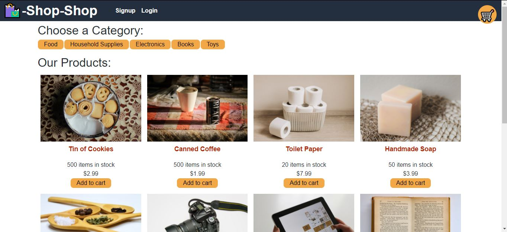

# shop-shop-Redux
  
  ### Github: https://github.com/cruzma/shop-shop.git
  ### website: https://serene-caverns-56086.herokuapp.com/ 

  ## Table of Contents
  - [Description](#description)
  - [User&nbsp;Story](#User&nbsp;Story)
  - [Acceptance&nbsp;Criteria](#Acceptance&nbsp;Criteria)

  ## Description
  An e-commerce website that allows users to buy products from.<br/>
  <br/>
  <br/>

  ## User Story
    ```
    AS a senior engineer working on an e-commerce platform
    I WANT my platform to use Redux to manage global state instead of the Context API
    SO THAT my website's state management is taken out of the React ecosystem

    ```

  ## Acceptance Criteria

    ```
    GIVEN an e-commerce platform that uses Redux to manage global state
    WHEN I review the app’s store
    THEN I find that the app uses a Redux store instead of the Context API
    WHEN I review the way the React front end accesses the store
    THEN I find that the app uses a Redux provider
    WHEN I review the way the app determines changes to its global state
    THEN I find that the app passes reducers to a Redux store instead of using the Context API
    WHEN I review the way the app extracts state data from the store
    THEN I find that the app uses Redux instead of the Context API
    WHEN I review the way the app dispatches actions
    THEN I find that the app uses Redux instead of the Context API

    ```


